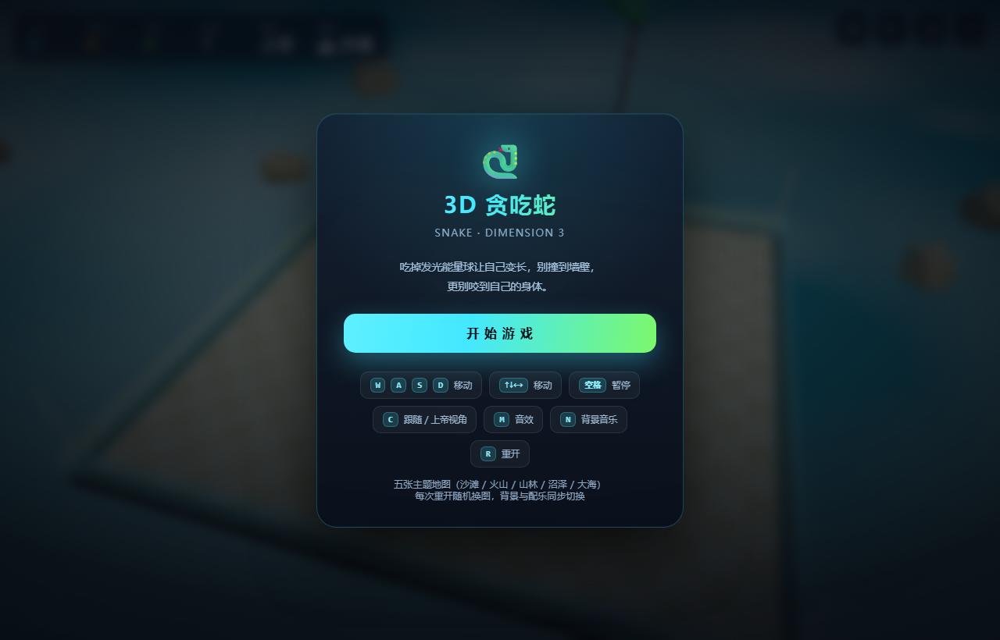
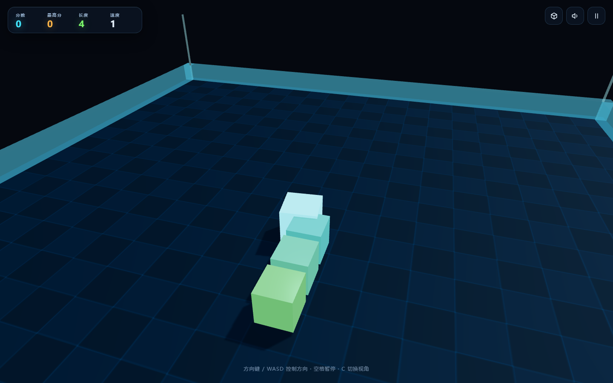

# 🐍 Snake 3D · 3D 贪吃蛇

用 Three.js 打造的 3D 贪吃蛇游戏 —— 提供开箱即用的网页版（单 HTML 文件）与 Electron 桌面版（Windows 便携 exe）。

<p align="center">
  
  &nbsp;
  
</p>

## ✨ 特性

- **真实 3D 渲染**：Three.js + WebGL，20×20 霓虹棋盘、发光能量球、实时阴影与粒子爆散特效
- **跟随镜头**：相机平滑追焦蛇头，偏航角插值转向不突兀；一键切换 立体俯瞰 / 上帝视角
- **手感调校**：帧率无关的固定步长模拟 + 帧间插值，转向队列防止快速连按丢失输入
- **完整规则**：自撞判定含"尾部让位"细节、吃到食物随机刷新且不与蛇身重叠、逐级加速（12 档封顶）
- **细节体验**：死亡震屏 + 红闪、8-bit 音效、失焦自动暂停、最高分本地存档
- **跨端**：网页版零依赖单文件；桌面版完全离线，GPU 异常时自动降级软件渲染

## 🎮 操作

| 按键 | 功能 |
| --- | --- |
| `W A S D` / `方向键` | 控制方向 |
| `空格` | 暂停 / 继续 |
| `C` | 切换视角（跟随 → 立体俯瞰 → 上帝视角） |
| `R` / `Enter` | 重新开始 |
| `M` | 音效开关 |

移动端：滑动屏幕或使用右下角虚拟方向键。

## 🚀 快速开始

### 网页版

`web/index.html` 是零依赖单文件，双击即可在浏览器中游玩（three.js 由 CDN 加载，首次需联网）。

也可以起一个本地服务：

```bash
cd web
python -m http.server 8080   # 或 npx serve .
```

### 桌面版

到 [Releases](https://github.com/ilses1/snake-3d/releases) 下载对应平台的安装包，无需自行编译：

| 平台 | 文件 | 说明 |
| --- | --- | --- |
| Windows | `Snake3D-Portable.exe` | 免安装便携版，双击即玩 |
| macOS | `Snake3D-*-arm64.dmg` / `Snake3D-*-x64.dmg` | Apple 芯片选 arm64，Intel 选 x64 |
| Linux | `Snake3D-*.AppImage` / `Snake3D-*.deb` | AppImage 通用；deb 适用于 Debian/Ubuntu |

> 构建产物未做代码签名，首次打开可能被系统拦截：
> **Windows** 在 SmartScreen 提示中点「更多信息 → 仍要运行」；
> **macOS** 右键点击 App 选择「打开」，或执行 `xattr -cr /Applications/Snake3D.app`；
> **Linux** AppImage 需先 `chmod +x Snake3D-*.AppImage`。

#### 从源码构建

```bash
cd desktop
npm install          # 安装 Electron 与打包工具
npm start            # 开发模式直接运行
npm run dist         # Windows：dist/Snake3D-Portable.exe
npm run dist:linux   # Linux：AppImage + deb
npm run dist:mac     # macOS：dmg + zip（x64 与 arm64）
```

> 桌面版将 three.js 随包分发，运行时**完全离线**；主进程内置仅监听 127.0.0.1 的本地静态服务托管页面。
> 一般不需要本地构建：推送 tag 后 GitHub Actions 会自动完成三平台打包并发布到 Release。

## 📁 目录结构

```
├── web/                 # 网页版（单 HTML 文件，CDN 引入 three.js）
├── desktop/             # Electron 桌面版
│   ├── main.js          # 主进程：本地静态服务 + 窗口管理 + GPU 降级
│   ├── index.html       # 由 web/index.html 同步生成（npm run sync）
│   ├── three.module.js  # 随包分发的 three.js r161
│   ├── scripts/sync-web.mjs
│   └── package.json
├── docs/                # 截图
└── .github/workflows/   # CI：打 tag 自动打包三平台安装包并发布 Release；main 变更自动部署 Pages
```

## 🛠 技术要点

- **模拟与渲染分离**：逻辑以固定步长推进（初始 175ms/步，随分数提速），渲染层对每节身体做帧间插值，任何刷新率下移动都平滑
- **自撞判定**：蛇尾本回合会移开的格子不算碰撞（仅在吃食物增长时例外），这是经典贪吃蛇最容易写错的细节
- **镜头控制**：偏航角用最短角差插值（angleLerp），蛇急转弯时相机平滑跟随而非瞬间切换
- **桌面版健壮性**：GPU 进程连续崩溃 3 次自动写入标记并以软件渲染重启，保证虚拟机 / 远程桌面环境可玩

## 📦 发布新版本

```bash
git tag v1.0.1
git push origin v1.0.1     # CI 并行打包 Windows / macOS / Linux 并附到 GitHub Release
```

## License

[MIT](LICENSE)
